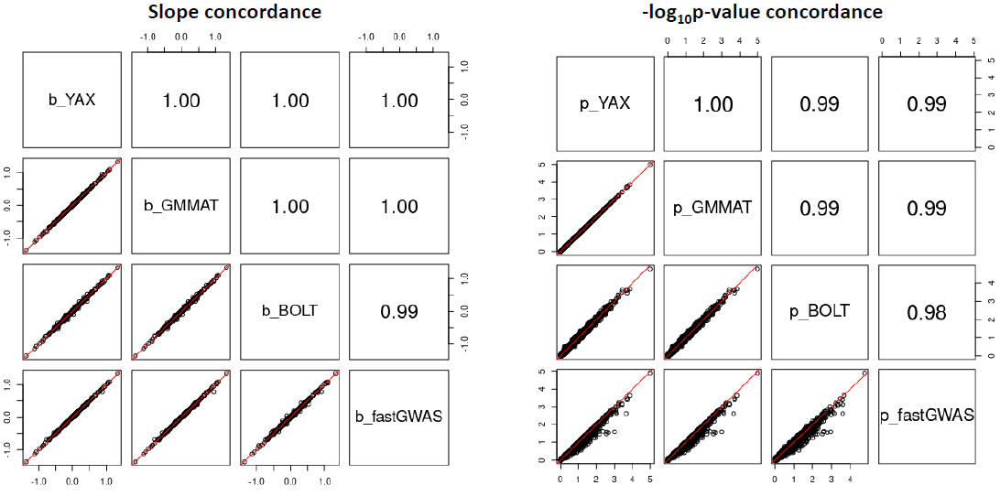
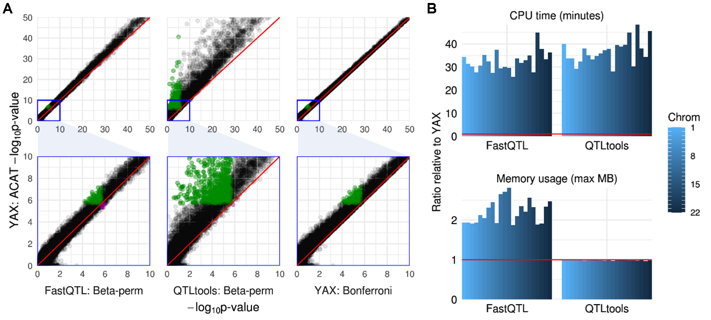

# YAX: cis-xQTL analysis guide
This page describes benchmarking experiments with YAX for various QTL analysis tasks.  This is intended to serve as a guide for time and memory usage requirements,  identify and delineate numerical  differences between software tools, and highlight unique features of YAX.  <br />

##### Table of Contents  

 1. [LMM Benchmarking](#lmm-benchmarking)   
 2. [cis-eQTL Benchmarking](#cis-eqtl-benchmarking)
 3. [Meta-analysis](#meta-analysis) 
 4. [References](#references) <br />

 [*Return to YAX main page.*](/yax/)


## LMM Benchmarking

We used empirical genotype data for 10,000 samples and simulated molecular phenotype data to benchmark time and memory for trans-xQTL analysis using a linear mixed model (LMM) using YAX LMM, FastGWA<sup>1</sup>, BOLT-LMM<sup>2</sup>, and GMMAT<sup>3-4</sup>. 

### Input data


| Sample size |No. traits | No. SNPs | No. covariates |
|-------------|-----------------:|---------------:|---------------------:|
| 10,000      |           16,329 |        590,606 |                   10 |


### Time and memory usage


|                 |     CPU   hours    |     Time   speedup    |     Max   memory    |
|-----------------|-------------------:|----------------------:|--------------------:|
|     YAX, p < 5e-5    |             7.5    |               0.36    |        4.88   Gb    |
|     YAX         |            20.8    |              1.00*    |       4.88   Gb     |
|     FastGWA     |            52.1    |               2.50    |        0.14   Gb    |
|     BOLT-LMM    |         1,068.9    |              51.39    |        0.67   Gb    |
|     GMMAT       |       ~*5,692.5*     |            ~*273.68*    |             N/A     |


### Software commands

Commands used in LMM benchmarking analysis are given below:

**YAX command:**
 - parallel over chromosomes, all traits at once
 - sparse GRM 
 - compressed BCF format genotype data
```
yax trans --bed $all_traits_bed --bcf $bcf --cov $covar_txt --grm $grm --region ${chr} --out trans_chr${chr}
```
**BOLT-LMM command:**
 - parallel over traits, all chroms at once 
 - 172,045 LD-pruned SNPs (no sparse GRM)
 - uncompressed BED/BIM/FAM format genotype data
```
bolt --lmm --LDscoresFile=$ldsc_f --bfile=$bfile --phenoFile=trait_${trait}.ped --phenoCol=${trait} --qCovarCol=PC{1:10} --covarFile=$covar_ped --modelSnps=${snp_file} --statsFile=bolt_${trait}
```
**fastGWA command:**
 - parallel over traits, all chroms at once 
 - Sparse GRM
 - uncompressed BED/BIM/FAM format genotype data
```
gcta64 --fastGWA-mlm --bfile $bfile --grm-sparse $sgrm --pheno trait_${trait}.ped --qcovar $covar_ped --threads 1 --out gcta_${trait}
```
**GMMAT command:**
 - parallel over traits, parallel over chroms
 - Sparse GRM
 - Compressed GDS format genotype data
```
eqn <- as.formula( Y ~ PC1 + PC2 + PC3 + PC4 + PC5 + PC6 + PC7 + PC8 + PC9 + PC10)
null_fit <- GMMAT::glmmkin(
	eqn, data = trait_data, id = "id", 
	kins = GRM, family = gaussian(), 
	method = "REML", method.optim = "AI", verbose = TRUE
)
GMMAT::glmm.score(obj = null_fit, infile = gds_file, outfile = trait_out_file, verbose = TRUE)
```

**Software concordance:**



LMM association tests from YAX and GMMAT are nearly numerically equivalent, as expected.  BOLT-LMM uses the conjugate gradient method to avoid storing an explicit GRM, and a retrospective quasi-likelihood score test; these differences may explain differences with YAX and GMMAT.  FastGWA uses the GRAMMAR-Gamma approximation to calculate association tests, which may  explain  differences with YAX and GMMAT.  Results are shown for 1 gene on chromosome 1, and are reflective of overall trends. 

## cis-eQTL Benchmarking

We compared cis-eQTL analysis using YAX, FastQTL<sup>5</sup>, and QTLtools<sup>6</sup> in the Geuvadis LCL eQTL data set<sup>7-8</sup> (454 samples, 17815 genes, and 70 covariates including PEER factors<sup>12</sup>). Single-variant association slopes and p-values are equivalent between FastQTL and YAX (not shown). QTLtools fits simple linear regressions between trait residuals and genotypes (`lm(y_resid ~ geno)`) rather than using multiple regression t-tests (`lm(y ~ geno + covariates)`), and therefore its p-values are slightly conservative.  
 
YAX calculates gene-level cis-eQTL p-values accounting for LD using ACAT<sup>11</sup>, which aggregates all single-variant p-values across the cis region. FastQTL and QTLtools calculate gene-level cis-eQTL p-values accounting for LD by modeling the null distribution of the minimum single-variant p-value as a beta density, with beta parameters estimated by permutation.  In the examples below, results using the two methods are highly similar, but ACAT is ~30x faster. In simulation studies, both type I error rates from both methods (ACAT and permutation-based beta approximation) are well-calibrated. 

### Results



A: Gene-level cis-eQTL p-values in the Geuvadis LCL dataset. Associations detected only by ACAT are marked in green in each column; associations detected only by FastQTL, QTLtools, or Bonferroni (but not ACAT) are marked in magenta.  
 
B: Comparison of time and memory usage for FastQTL and QTLtools. FastQTL was run using the adaptive p-value setting with 100 to 1000 permutations; QTLtools was run using 1000 permutations; YAX uses ACAT to account for LD rather than permutations. For each software, autosomal cis-eQTL analysis was run in parallel with 1 CPU per chromosome.

## Meta-analysis

Multiple-variant meta-analysis in YAX requires sumstat files (generated by `./yax cis`), which store SNP-trait association data, and vcov files (`./yax store`), which store SNP-SNP covariate-adjusted linkage disequilibrium (LD) data.  
 
We compared sumstat and vcov file storage sizes across 3 QTL studies:

### Data sets


|                     |     GTEx LCLs<sup>9</sup>    |      Geuvadis<sup>7-8</sup>      |       HapMap<sup>10</sup>      |
|---------------------|:-------------------:|:-----------------:|:-----------------:|
|     Variants        |      10,932,660     |     10,945,700    |     10,943,352    |
|     Sample size     |          147        |         454       |         518       |
|     Covariates      |          23         |         70        |         97        |
|     Genes           |        22,759       |       17,815      |       16,329      |


### Storage size 


|                                    |     GTEx v8 LCLs    |      Geuvadis     |       HapMap      |
|------------------------------------|:-------------------:|:-----------------:|:-----------------:|
|     vcov file size (2MB window)    |      19.45   Gb     |     30.38   Gb    |     36.16   Gb    |
|     vcov index size                |       0.56   Gb     |      1.61   Gb    |      2.67   Gb    |
|     cis sumstats size              |       0.45   Gb     |      0.39   Gb    |      0.43   Gb    |


## References

1. Jiang, Longda, et al. A resource-efficient tool for mixed model association analysis of large-scale data. Nature Publishing Group, 2019. [fastGWA software.](https://cnsgenomics.com/software/gcta/#fastGWA)
2. Loh, Po-Ru, et al. "Efficient Bayesian mixed-model analysis increases association power in large cohorts." Nature genetics 47.3 (2015): 284. [BOLT-LMM software.](https://storage.googleapis.com/broad-alkesgroup-public/BOLT-LMM/downloads/BOLT-LMM_v2.3.4_manual.pdf)
3. Chen, Han, et al. "Control for population structure and relatedness for binary traits in genetic association studies via logistic mixed models." The American Journal of Human Genetics 98.4 (2016): 653-666. [GMMAT software.](https://cran.r-project.org/web/packages/GMMAT/index.html)
4. Chen, Han, Matthew P. Conomos, and Duy T. Pham. "GMMAT-package: Generalized Linear Mixed Model Association Tests." (2020).
5. Ongen, Halit, et al. "Fast and efficient QTL mapper for thousands of molecular phenotypes." Bioinformatics 32.10 (2016): 1479-1485.  [FastQTL software.](http://fastqtl.sourceforge.net/)
6. Delaneau, Olivier, et al. "A complete tool set for molecular QTL discovery and analysis." Nature communications 8.1 (2017): 1-7.  [QTLtools software.](https://qtltools.github.io/qtltools/)
7. Lappalainen, Tuuli, et al. "Transcriptome and genome sequencing uncovers functional variation in humans." Nature 501.7468 (2013): 506-511.
8. 1000 Genomes Project Consortium. "An integrated map of genetic variation from 1,092 human genomes." Nature 491.7422 (2012): 56-65.
9. GTEx Consortium. "The GTEx Consortium atlas of genetic regulatory effects across human tissues." Science 369.6509 (2020): 1318-1330.
10. Bell, Jordana T., et al. "DNA methylation patterns associate with genetic and gene expression variation in HapMap cell lines." Genome biology 12.1 (2011): R10.
11. Liu, Yaowu, et al. "Acat: A fast and powerful p value combination method for rare-variant analysis in sequencing studies." The American Journal of Human Genetics 104.3 (2019): 410-421.
12. Stegle, Oliver, et al. "Using probabilistic estimation of expression residuals (PEER) to obtain increased power and interpretability of gene expression analyses." Nature protocols 7.3 (2012): 500.
